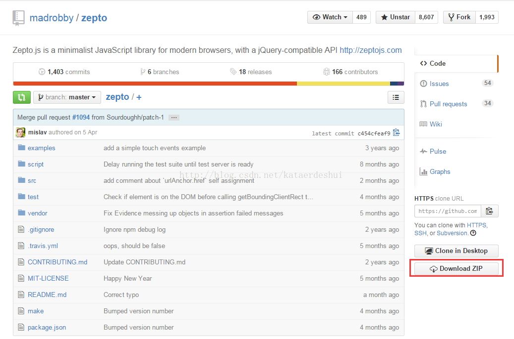
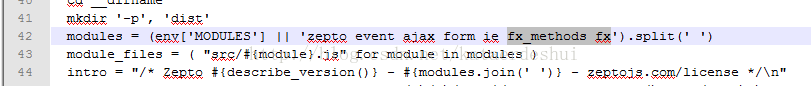
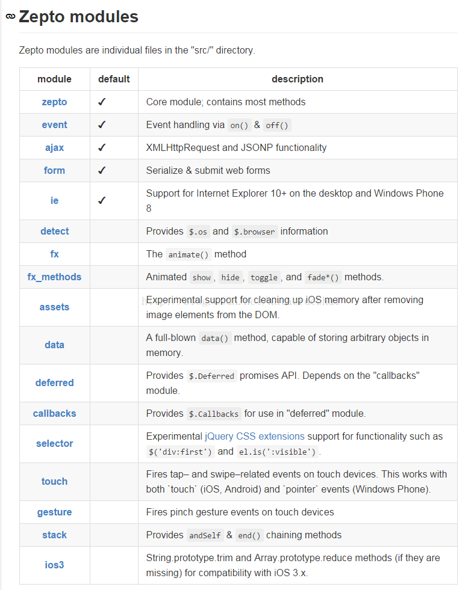
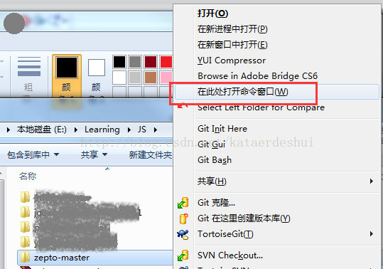
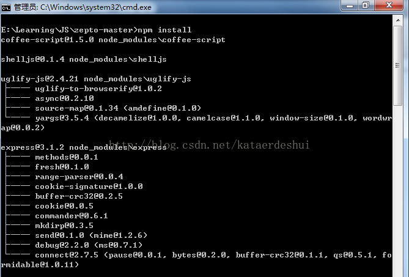
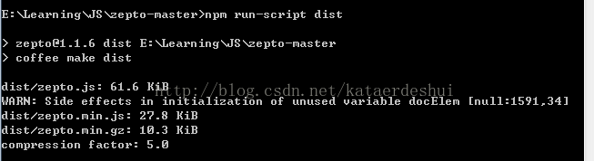
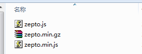

# zepto.js 自定义打包集成其他模块构建流程

1、首先在自己的电脑上要安装node.js和npm包管理工具；

2、从github上下载zepto.js的源文件包到本地磁盘（例如：E:\Learning\JS）；

​        地址：https://github.com/madrobby/zepto

3、将下载的zepto压缩包解压，进入，找到make文件，打开，找到第42行的位置，添加需要的模块名称（这里我增加了fx_methods 和 fx 模块），以空格做分隔；

zepto模块名称：

4、运行中，cmd打开命令窗口，并进入zepto文件目录；

或选中文件夹按住shift键并右键选择"在此处打开命令窗口”快捷方式打开；

5、执行 npm install 命令；

6、输入npm run-script dist 命令，进行构建；

执行成功后，在dist文件夹怎会有如下文件：  说明打包已成功

